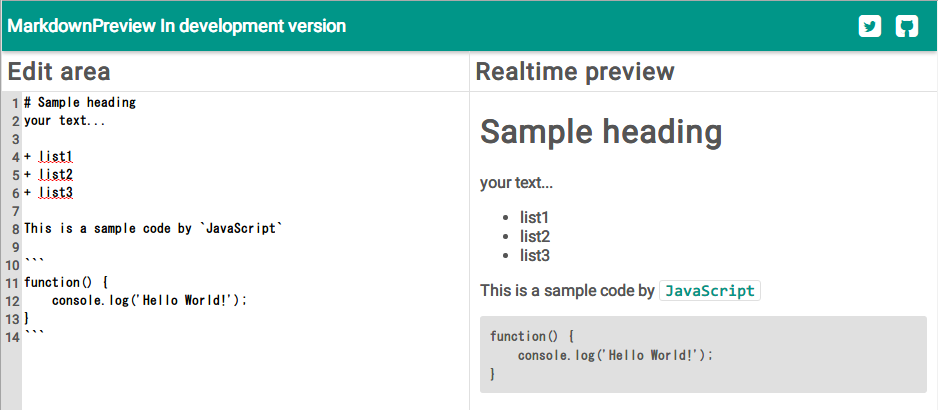

# ReactTraning

This is MarkdownEditor utilizing a React.js and ES6.
ReactTraning with ES6 is the coding and the tools for the practice of React.js.

# Installation
Clone or downlaod zip.

# Usage
Please open the `index.html` in your browser.
That's all.

# Demo version in development
http://tomoyashibata.github.io/ReactTraning/